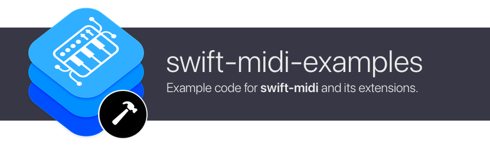

# swift-midi-examples

Example code for [swift-midi](https://github.com/orchetect/swift-midi) and its extensions.

## Compatibility

Currently all example projects are built for Apple platforms, but the sample code may be used for other platforms that swift-midi is currently compatible with (or may be in future).

## Documentation & Support

For documentation and support see the main [swift-midi](https://github.com/orchetect/swift-midi) repository.

## Author

Coded by a bunch of 🐹 hamsters in a trenchcoat that calls itself [@orchetect](https://github.com/orchetect).

## License

Licensed under the MIT license. See [LICENSE](https://github.com/orchetect/swift-midi-examples/blob/master/LICENSE) for details.